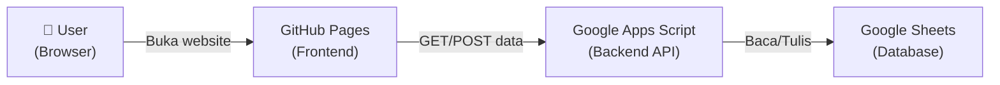

# 📋 Tutorial Lengkap: Deploy Aplikasi Supervisi Keperawatan

> Tutorial ini menjelaskan langkah demi langkah dari **0 sampai aplikasi berjalan lancar**, termasuk setup Google Sheets (backend), deploy ke GitHub Pages (frontend), dan menghubungkan keduanya.

---

## 🏗️ Arsitektur Aplikasi



| Komponen | Platform | Fungsi |
|----------|----------|--------|
| Frontend (HTML/CSS/JS) | GitHub Pages | Tampilan aplikasi |
| Backend (API) | Google Apps Script | Proses & simpan data |
| Database | Google Sheets | Penyimpanan data |

---

## BAGIAN 1: Setup Google Sheets & Apps Script (Backend)

### Langkah 1.1 — Buat Google Sheets Baru

1. Buka browser, pergi ke [sheets.new](https://sheets.new)
2. Google Sheets baru akan terbuka
3. **Beri nama spreadsheet**: klik judul "Untitled spreadsheet" di kiri atas
4. Ketik: `Supervisi Keperawatan RS`
5. Tekan Enter

> [!NOTE]
> Spreadsheet ini akan menjadi "database" aplikasi Anda. Semua data supervisi tersimpan di sini.

---

### Langkah 1.2 — Buka Apps Script Editor

1. Di Google Sheets, klik menu **Ekstensi** (Extensions) di menu bar atas
2. Klik **Apps Script**
3. Tab baru akan terbuka dengan editor Apps Script

---

### Langkah 1.3 — Paste Kode Apps Script

1. Di editor Apps Script, Anda akan melihat file `Code.gs` dengan kode default:
   ```javascript
   function myFunction() {
   }
   ```
2. **Hapus semua kode default** tersebut (Ctrl+A → Delete)
3. **Buka file** `Code.gs` dari folder project Anda (`c:\Users\aripr\Downloads\aplikasi\Code.gs`)
4. **Copy seluruh isi** file tersebut (Ctrl+A → Ctrl+C)
5. **Paste** ke editor Apps Script (Ctrl+V)
6. Klik tombol **💾 Save** (atau Ctrl+S)

> [!IMPORTANT]
> Pastikan Anda meng-copy **SELURUH** isi file Code.gs, dari baris pertama hingga terakhir. Jangan sampai terpotong!

---

### Langkah 1.4 — Jalankan Setup Awal

1. Di editor Apps Script, pilih fungsi **`setupSheets`** dari dropdown di toolbar (sebelah tombol ▶ Run)
2. Klik tombol **▶ Run**
3. Pertama kali, Google akan minta **otorisasi (izin akses)**:
   - Klik **Review permissions**
   - Pilih akun Google Anda
   - Jika muncul "Google hasn't verified this app", klik **Advanced** → **Go to Supervisi Keperawatan RS (unsafe)**
   - Klik **Allow**
4. Tunggu beberapa detik, akan muncul alert: **"Setup selesai! Sheet berhasil dibuat."**
5. Klik **OK**

Sekarang kembali ke Google Sheets Anda — akan muncul **3 sheet**:
- `Data_Supervisi` — untuk menyimpan data formulir
- `Rekap_Bulanan` — rekap otomatis per bulan
- `Master_Staf` — daftar perawat & ruangan

---

### Langkah 1.5 — Deploy Sebagai Web App

> [!CAUTION]
> Ini adalah langkah PALING PENTING. Jika salah setting, data dari form tidak akan tersimpan.

1. Di editor Apps Script, klik menu **Deploy** > **New deployment**
2. Klik ikon ⚙️ (gear) di sebelah "Select type" → pilih **Web app**
3. Isi pengaturan:

   | Setting | Nilai |
   |---------|-------|
   | Description | `Supervisi v1` |
   | Execute as | **Me** (akun email Anda) |
   | Who has access | **Anyone** |

4. Klik **Deploy**
5. **SALIN URL** yang muncul! URL-nya akan seperti:
   ```
   https://script.google.com/macros/s/AKfycbx.../exec
   ```

> [!WARNING]
> **Simpan URL ini baik-baik!** Anda akan membutuhkannya di langkah selanjutnya. Jika lupa, bisa dilihat di Deploy → Manage deployments.

---

## BAGIAN 2: Setup GitHub & Deploy ke GitHub Pages (Frontend)

### Langkah 2.1 — Buat Akun GitHub (jika belum punya)

1. Buka [github.com](https://github.com)
2. Klik **Sign up**
3. Ikuti langkah pendaftaran (email, password, username)
4. Verifikasi email Anda

---

### Langkah 2.2 — Install Git di Komputer

1. Buka [git-scm.com/download/win](https://git-scm.com/download/win)
2. Download installer Git untuk Windows
3. Jalankan installer, klik **Next** terus sampai **Install**
4. Setelah selesai, buka **Command Prompt** atau **PowerShell**
5. Ketik untuk verifikasi:
   ```powershell
   git --version
   ```
   Harus muncul seperti: `git version 2.xx.x`

---

### Langkah 2.3 — Konfigurasi Git (pertama kali saja)

Buka **PowerShell** atau **Command Prompt**, jalankan:

```powershell
git config --global user.name "Nama Anda"
git config --global user.email "email@gmail.com"
```

> [!NOTE]
> Ganti `"Nama Anda"` dengan nama Anda dan `"email@gmail.com"` dengan email GitHub Anda.

---

### Langkah 2.4 — Update URL di config.js

**Sebelum upload ke GitHub**, pastikan URL di `config.js` sudah benar:

1. Buka file `c:\Users\aripr\Downloads\aplikasi\config.js`
2. Ganti nilai `APPS_SCRIPT_URL` dengan URL yang Anda salin di Langkah 1.5:

```javascript
const CONFIG = {
  APPS_SCRIPT_URL: 'https://script.google.com/macros/s/URL_ANDA_DARI_LANGKAH_1.5/exec',  // ← GANTI INI
  APP_NAME: 'Supervisi Keperawatan Rawat Inap',
  RS_NAME: 'RS [UNAIR RUANG IRNA 5A]',
  VERSION: '1.0.0'
};
```

3. **Simpan file** (Ctrl+S)

> [!CAUTION]
> Jika URL tidak diganti, form akan tetap bisa diisi tapi data **TIDAK akan tersimpan** ke Google Sheets!

---

### Langkah 2.5 — Buat Repository di GitHub

1. Buka [github.com/new](https://github.com/new)
2. Isi form:

   | Field | Nilai |
   |-------|-------|
   | Repository name | `supervisi-keperawatan` (atau nama lain sesuai keinginan) |
   | Description | `Aplikasi Supervisi Keperawatan Rawat Inap` |
   | Visibility | **Public** (wajib untuk GitHub Pages gratis) |
   | Initialize | ❌ Jangan centang apapun |

3. Klik **Create repository**
4. Halaman repository kosong akan muncul. **Jangan tutup halaman ini.**

---

### Langkah 2.6 — Upload Kode ke GitHub

Buka **PowerShell**, lalu jalankan perintah berikut **satu per satu**:

```powershell
# 1. Masuk ke folder project
cd C:\Users\aripr\Downloads\aplikasi

# 2. Inisialisasi Git
git init

# 3. Tambahkan semua file
git add .

# 4. Buat commit pertama
git commit -m "Initial commit: Aplikasi Supervisi Keperawatan"

# 5. Set branch utama
git branch -M main

# 6. Hubungkan ke repository GitHub (GANTI username dan nama repo!)
git remote add origin https://github.com/USERNAME_ANDA/supervisi-keperawatan.git

# 7. Push (upload) ke GitHub
git push -u origin main
```

> [!IMPORTANT]
> Pada langkah 6, ganti `USERNAME_ANDA` dengan username GitHub Anda yang sesungguhnya! Contoh: `https://github.com/aripr/supervisi-keperawatan.git`

Saat push, GitHub mungkin meminta login:
- Jika muncul popup browser, login dengan akun GitHub Anda
- Jika muncul prompt di terminal, masukkan username dan **Personal Access Token** (bukan password)

### Cara Membuat Personal Access Token (jika diminta):
1. Buka [github.com/settings/tokens](https://github.com/settings/tokens)
2. Klik **Generate new token** → **Generate new token (classic)**
3. Isi Note: `Git access`
4. Pilih expiration: **90 days** atau **No expiration**
5. Centang scope: **repo** (semua sub-scope di bawahnya otomatis tercentang)
6. Klik **Generate token**
7. **COPY token yang muncul** (warnanya hijau) — ini hanya ditampilkan SEKALI
8. Gunakan token ini sebagai pengganti password saat git push

---

### Langkah 2.7 — Aktifkan GitHub Pages

1. Buka repository Anda di GitHub: `https://github.com/USERNAME_ANDA/supervisi-keperawatan`
2. Klik tab **Settings** (⚙️) di menu atas repository
3. Di sidebar kiri, klik **Pages**
4. Di bagian **"Build and deployment"**:

   | Setting | Nilai |
   |---------|-------|
   | Source | **Deploy from a branch** |
   | Branch | **main** |
   | Folder | **/ (root)** |

5. Klik **Save**
6. Tunggu **1-3 menit**, refresh halaman
7. Akan muncul banner hijau di atas:

   ```
   ✅ Your site is live at https://USERNAME_ANDA.github.io/supervisi-keperawatan/
   ```

🎉 **Selamat! Aplikasi Anda sekarang sudah online!**

---

## BAGIAN 3: Testing — Pastikan Semuanya Berfungsi

### Test 1: Buka Aplikasi Web

1. Buka URL: `https://USERNAME_ANDA.github.io/supervisi-keperawatan/`
2. Halaman beranda harus tampil dengan benar
3. Navigasi ke: Formulir, Rekap, Dashboard — semua harus bisa dibuka

---

### Test 2: Isi dan Kirim Formulir

1. Klik **Formulir** di menu navigasi
2. Isi semua field:
   - Nama Supervisor: `Test Supervisor`
   - Tanggal: (pilih tanggal hari ini)
   - Ruangan: (pilih salah satu)
   - Shift: (pilih salah satu)
   - Nama Perawat: (pilih salah satu)
3. Beri skor untuk semua item instrumen (klik tombol 1-4)
4. Klik **Lanjut ke Catatan** → isi catatan (opsional) → **Lanjut ke Pratinjau**
5. Klik **Simpan & Kirim ke Google Sheets**
6. Harus muncul pesan: **"Data berhasil dikirim ke Google Sheets"**

---

### Test 3: Periksa Data di Google Sheets

1. Buka Google Sheets `Supervisi Keperawatan RS`
2. Klik sheet **Data_Supervisi**
3. Data yang baru dikirm harus muncul sebagai baris baru
4. Periksa juga sheet **Rekap_Bulanan** — harus ter-update otomatis

> [!TIP]
> Jika data muncul di sheet, berarti semuanya berfungsi dengan baik! 🎉

---

## BAGIAN 4: Troubleshooting (Mengatasi Masalah)

### ❌ Problem: Data tidak tersimpan ke Sheets

**Penyebab & Solusi:**

| Cek Ini | Solusi |
|----------|--------|
| URL di `config.js` salah | Pastikan URL sama persis dengan yang di-copy dari deployment Apps Script |
| Belum deploy ulang setelah edit Code.gs | Buat **New deployment** lagi di Apps Script (bukan edit yang lama) |
| "Who has access" salah | Harus **Anyone**, bukan "Only myself" |
| Cache browser | Coba buka di **Incognito mode** (Ctrl+Shift+N) |

### ❌ Problem: Halaman kosong / error saat buka GitHub Pages

**Penyebab & Solusi:**

| Cek Ini | Solusi |
|----------|--------|
| GitHub Pages belum aktif | Tunggu 1-3 menit setelah push pertama |
| URL salah | Pastikan buka `https://USERNAME.github.io/NAMA-REPO/` (pakai trailing slash) |
| File `index.html` tidak di root | Pastikan `index.html` ada di root folder, bukan di subfolder |

### ❌ Problem: CORS Error di Console Browser

Ini sudah ditangani oleh kode yang sudah diperbaiki. Jika masih terjadi:

1. Buka **Apps Script Editor**
2. Pastikan kode `Code.gs` sudah versi terbaru (yang ada fungsi `saveData` di `doGet` dan `simpanDataSupervisi`)
3. **Deploy → New deployment** (buat deployment BARU)
4. **Update URL baru** di `config.js`
5. Commit & push lagi ke GitHub

### ❌ Problem: Error "Authorization required"

1. Buka Apps Script Editor
2. Jalankan fungsi `setupSheets` dengan klik ▶ Run
3. Ikuti proses otorisasi ulang (Allow permissions)
4. Setelah itu, buat **New deployment** lagi

---

## BAGIAN 5: Cara Update Aplikasi di Kemudian Hari

Jika Anda ingin mengubah kode di kemudian hari:

### Update Frontend (HTML/CSS/JS):

```powershell
# 1. Masuk ke folder project
cd C:\Users\aripr\Downloads\aplikasi

# 2. Simpan perubahan
git add .
git commit -m "Deskripsi perubahan yang dilakukan"
git push
```
GitHub Pages akan otomatis update dalam 1-2 menit.

### Update Backend (Code.gs):

1. Buka Google Sheets → Ekstensi → Apps Script
2. Edit kode di `Code.gs`
3. **Klik Save**
4. **Deploy → New deployment** (harus buat baru!)
5. Copy URL baru → Update di `config.js` → push ke GitHub

> [!WARNING]
> Setiap kali edit `Code.gs`, Anda **HARUS** buat **New deployment**. Mengedit kode saja **TIDAK** mengupdate Web App yang sudah di-deploy. URL deployment baru akan berbeda dari yang lama!

---

## 📎 Ringkasan URL & File Penting

| Item | Lokasi |
|------|--------|
| Aplikasi Web | `https://USERNAME.github.io/supervisi-keperawatan/` |
| Google Sheets | Buka dari Google Drive Anda |
| Apps Script Editor | Google Sheets → Ekstensi → Apps Script |
| File Frontend | `index.html`, `form.html`, `rekap.html`, `dashboard.html`, `style.css`, `config.js` |
| File Backend | `Code.gs` (di-paste ke Apps Script, **BUKAN** di-push ke GitHub) |

> [!NOTE]
> File `Code.gs` **tidak perlu** di-push ke GitHub — file ini hanya dipakai di Google Apps Script. Tapi tidak masalah juga jika ikut ter-push, karena GitHub Pages hanya menyajikan file HTML/CSS/JS.

---

## ✅ Checklist Final

- [ ] Google Sheets sudah dibuat dan diberi nama
- [ ] `Code.gs` sudah di-paste ke Apps Script Editor
- [ ] Fungsi `setupSheets` sudah dijalankan (sheet otomatis dibuat)
- [ ] Apps Script sudah di-deploy sebagai Web App (Anyone, Execute as Me)
- [ ] URL deployment sudah di-copy
- [ ] URL sudah di-paste ke `config.js` → `APPS_SCRIPT_URL`
- [ ] Git sudah terinstall
- [ ] Repository GitHub sudah dibuat (Public)
- [ ] Kode sudah di-push ke GitHub
- [ ] GitHub Pages sudah diaktifkan (branch: main, folder: root)
- [ ] Website bisa diakses via URL GitHub Pages
- [ ] Test kirim formulir → data muncul di Google Sheets ✅
